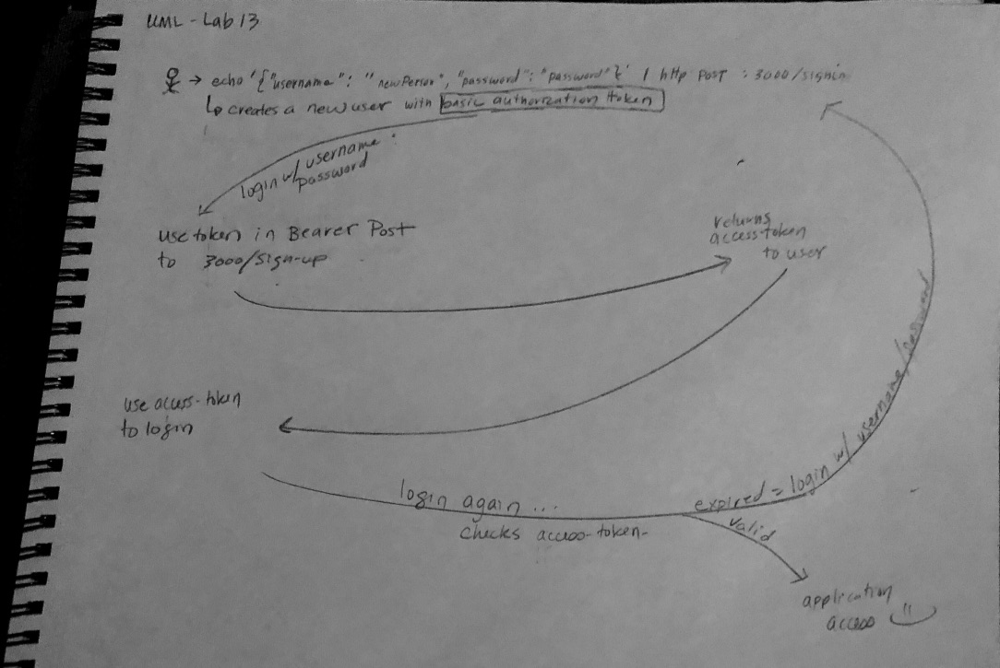

 LAB
=================================================

## Bearer Authorization

### Author: Erin Trainor

### Links and Resources
* [repo](http://xyz.com)
* [travis](https://www.travis-ci.com/401-advanced-javascript-401d29/lab-13)
* [back-end](https://hidden-sea-21748.herokuapp.com/)

#### Documentation
* [jsdoc](https://hidden-sea-21748.herokuapp.com/docs)
  * Note: I only JSDOCed new functions that I created or touched in this lab as the others were JSDOCed during the last lab.

### Setup
#### `.env` requirements
* `PORT` - 3000
* `MONGODB_URI` - MONGODB_URI=mongodb://localhost:27017/bearer
* `SECRET` - dog (or other secret of your choice)

#### Running the app
* To run Mongo
  * Open 3 terminal tabs
    * First tab
      * mongod --dbpath=/Users/erintrainor/codefellows/data/db (substitute your file path)
      * Second tab
        * mongo
      * Third tab
        * nodemon
  
#### Tests
* How do you run tests?
  * npm run test
* What assertions were made?
  * Just the tests that came with the starter code
* What assertions need to be / should be made?
  * The additional tests requested in the lab docs

#### UML

